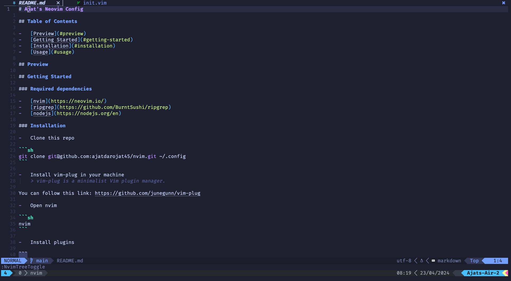
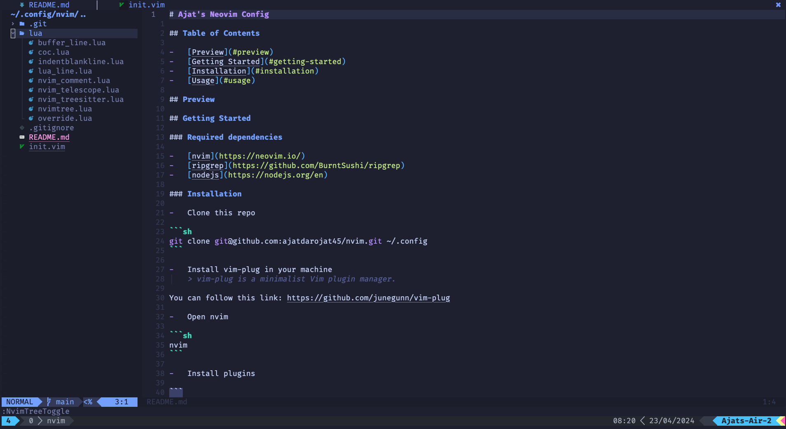
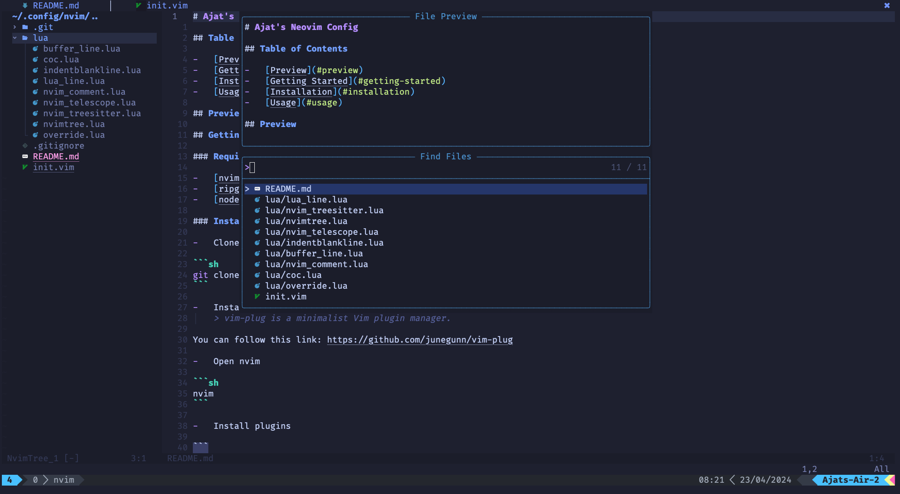

# Ajat's Neovim Config

## Table of Contents

-   [Preview](#preview)
-   [Getting Started](#getting-started)
-   [Installation](#installation)
-   [Usage](#usage)

## Preview

-   Preview 1
    

-   Preview 2
    

-   Preview 3
    

## Getting Started

### Required dependencies

-   [nvim](https://neovim.io/)
-   [ripgrep](https://github.com/BurntSushi/ripgrep)
-   [nodejs](https://nodejs.org/en)

### Installation

#### Clone this repo

```sh
git clone git@github.com:ajatdarojat45/nvim.git ~/.config/nvim
```

#### Install vim-plug in your machine

> vim-plug is a minimalist Vim plugin manager.

You can follow this link: https://github.com/junegunn/vim-plug

#### Open nvim

```sh
nvim
```

#### Install plugins

```
:PlugInstall
```

#### Install language parsers

```
:TSInstall <language_to_install>
```

Check supported languages [here](https://github.com/nvim-treesitter/nvim-treesitter#supported-languages)

#### Install coc extensions

```
:CocInstall <extensions_to_install>
```

Check extentions list [here](https://github.com/neoclide/coc.nvim/wiki/Using-coc-extensions#implemented-coc-extensions)

#### Install MarkdownPreview

```
:call mkdp#util#install()
```

## Usage

### Mappings

| Mappings        | Action                                     | State       |
| --------------- | ------------------------------------------ | ----------- |
| `i`             | Enter to insert mode                       | Normal Mode |
| `leader` + `s`  | Run `Prettier` and save changes            | Normal Mode |
| `leader` + `q`  | Quit                                       | Normal Mode |
| `jj`            | Exit insert mode quickly                   | Insert Mode |
| `o`             | Creating a new line below the current line | Normal Mode |
| `O`             | Creating a new line above the current line | Normal Mode |
| `Y`             | Yank/copy from cursor to the end of line   | Normal Mode |
| `p`             | Paste                                      | Normal Mode |
| `D`             | Delete from cursor to the end of line      | Normal Mode |
| `Shift` + `h`   | Move to previous buffers tab               | Normal Mode |
| `Shift` + `l`   | Move to next buffers tab                   | Normal Mode |
| `Shift` + `k`   | Move to first buffers tab                  | Normal Mode |
| `Shift` + `j`   | Move to last buffers tab                   | Normal Mode |
| `mp`            | Markdown Preview                           | Normal Mode |
| `leader` + `ee` | Toggle file explorer or open NvimTree      | Normal Mode |
| `a`             | Create a new folder or file                | NvimTree    |
| `c`             | Copy a folder or file                      | NvimTree    |
| `x`             | Cut a folder or file                       | NvimTree    |
| `p`             | Paste a folder or file                     | NvimTree    |
| `r`             | Rename a folder or file                    | NvimTree    |
| `d`             | Delete a folder or file                    | NvimTree    |
| `leader` + `ff` | Find files                                 | Normal Mode |
| `leader` + `fg` | Live grep or find words or characters      | Normal Mode |
| `leader` + `fb` | Find buffers                               | Normal Mode |

> I map the `leader` to the `space`. You can customize it if you need.
